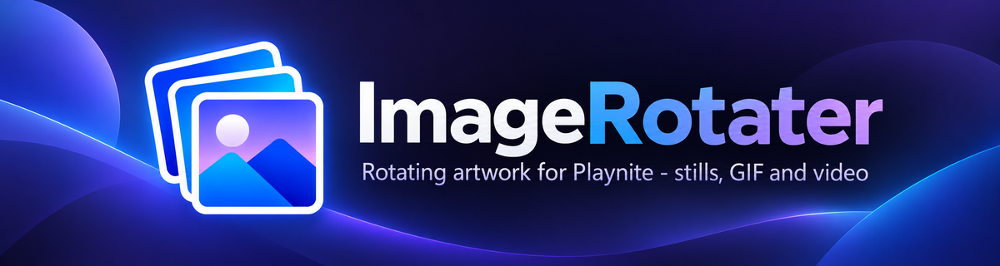
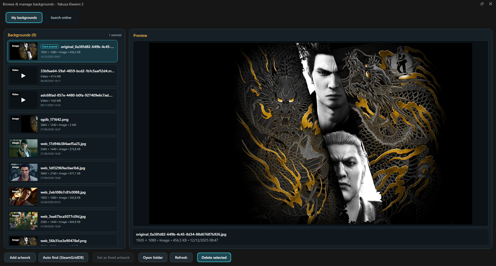
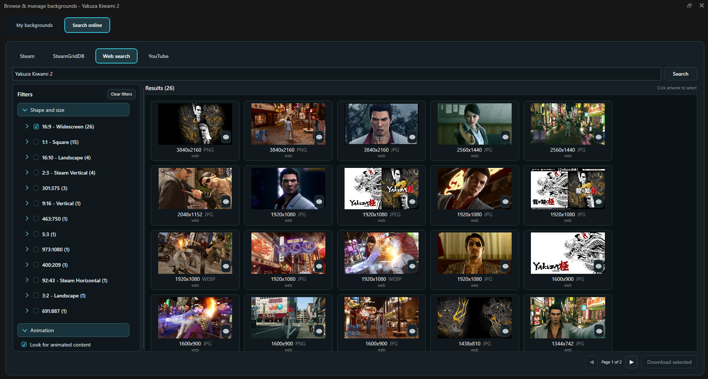

### Give each game more than one look.

  
  
  

ImageRotater is a Playnite extension that lets every game use a collection of covers and backgrounds instead of being limited to a single image.

Add the artwork you like, choose how you want it to behave, and ImageRotater takes care of switching it inside Playnite.

The plugin works in both **Desktop** and **Fullscreen** and lets you manage covers and backgrounds independently.

  
  

<h2 align="center">Project</h2>

### **[Huddini](https://github.com/aHuddini) × [Mike-Aniki](https://github.com/Mike-Aniki)**

ImageRotater was originally created by **Huddini** and is now developed collaboratively with **Mike-Aniki**.

 

[Support Huddini on Ko-fi](https://ko-fi.com/huddini)
·
[Support Mike Aniki on Ko-fi](https://ko-fi.com/mikeaniki)

---

<h2 align="center">More Than One Artwork per Game</h2>

Once a game has several covers or backgrounds, ImageRotater can decide which one Playnite should display.

You can keep one artwork for the whole Playnite session, choose a new one each time you focus the game, lock a specific artwork, or use slideshow rotation.

The detailed behavior and all available settings are explained in the User Guide.

### **[Read the User Guide](https://github.com/Mike-Aniki/ImageRotater/wiki)**

---

<h2 align="center">Works with Regular Playnite Themes</h2>

- For standard covers and backgrounds, **no special theme support is required**. ImageRotater uses Playnite's native artwork system, so static artwork works with regular themes in both Desktop and Fullscreen.

- For **animated covers or backgrounds**, theme integration is required. If your theme does not support animated artwork, ImageRotater will still work normally with static covers and backgrounds. **Aniki ReMake already includes ImageRotater integration.**

---

<h2 align="center">Coming from BackgroundChanger?</h2>

ImageRotater includes a migration tool for existing BackgroundChanger users.

Your current covers and backgrounds can be imported into ImageRotater's own artwork library without deleting the original BackgroundChanger files.

This makes it possible to move over without rebuilding your collection game by game.

Migration steps are documented in the User Guide.

---

<h2 align="center">For Users</h2>

The User Guide contains the complete documentation for using ImageRotater.

Installation, artwork management, rotation modes, online sources, optional tools, BackgroundChanger migration, troubleshooting, and advanced settings are all documented separately so the main project page stays easy to read.

### **[Open the User Guide](https://github.com/Mike-Aniki/ImageRotater/wiki)**

---

<h2 align="center">For Theme Authors</h2>

Theme integration has its own documentation.

If you are creating or updating a Playnite theme and want to support ImageRotater's animated covers and backgrounds, use the dedicated guide below.

### **[Open the Theme Integration Guide](docs/THEME_INTEGRATION.md)**

---

<h2 align="center">Links</h2>

[Latest Release](https://github.com/Mike-Aniki/ImageRotater/releases/latest)
·
[User Guide](https://github.com/Mike-Aniki/ImageRotater/wiki)
·
[Theme Integration](docs/THEME_INTEGRATION.md)
·
[Changelog](CHANGELOG.md)
·
[Issues](https://github.com/Mike-Aniki/ImageRotater/issues)
·
[Playnite](https://playnite.link/)

